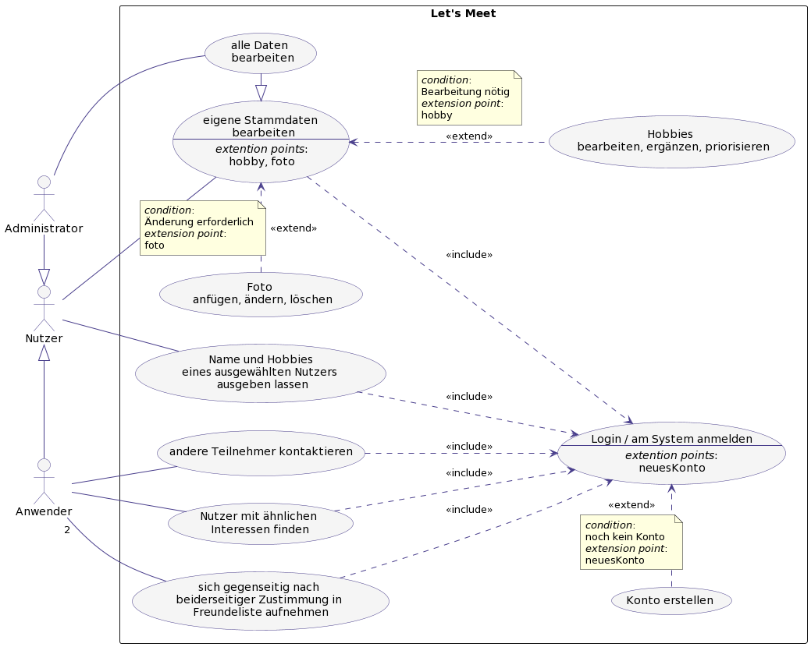

## Lernsituation: Migration "Let’s Meet"

### Ausgangslage:

Ihr Unternehmen hat eine neue Kundin gewonnen: die _Let’s Meet GmbH_, die eine Dating- und Meeting-Plattform betreibt.
Ihr Unternehmen soll die Dating-App der Kundin weiterentwickeln. Leider erfolgte die Trennung vom vorigen IT-Dienstleister im Streit und nicht reibungsfrei, sodass die Kundin keinen Zugriff auf die bestehenden Datenbanken hat. Es liegt lediglich ein Datenbank-Dump in Form einer Excel-Datei vor, die die Inhalte aller Tabellen erfasst. Außerdem gibt es einen Backup einer MongoDB sowie eine XML-Datei mit einigen Daten.


Ihr Team ist für die Datenanalyse und den Entwurf der neuen Datenbank sowie die Migration in neue Tabellen zuständig. Die eigentliche App wird von einem anderen Team betreut.

Ausgangslage ist der vorliegende Export der Datenbank als Excel-Tabelle. Um Problemen beim Ändern, Löschen und Einfügen von Datensätzen vorzubeugen, legt die Kundin sehr viel Wert darauf, im Vorfeld der Migration ein ausgefeiltes konzeptuelles Datenmodell zu erhalten. Anhand des Datenmodells soll die Kundin im Anschluss hinsichtlich der Wahl eines logischen Datenmodells und schließlich hinsichtlich eines Datenbankmanagementsystems beraten werden. Um nicht ein weiteres Mal ohne aussagekräftige Dokumente dazustehen, wünscht sich die Kundin zudem eine geeignete Dokumentation der einzelnen Entwurfsphasen und der reproduzierbaren Zwischenschritte.

Daneben existieren auch Daten in einer NoSql-Datenbank (MongoDB). Hier sind Likes und Nachrichten hinterlegt, die aus einer anderen App stammen. Diese sollen ebenfalls in die neue Datenbank migriert werden.

Desweiteren sind Hobbydaten in einer XML-Datei vorhanden und sollen ebenfalls migriert werden.

Alle genutzten SQL-Befehle und der Code für den Import sollen mit git versioniert werden. Dokumentieren Sie die durchgeführten Schritte bzw. die erstellten Diagramme, etc. jeweils in einer kurzen Markdown-Datei.

Das Zielsystem soll ein Postgres in einem Docker-Container sein. Der Docker-Container wurde bereits in der [compose.yml](compose.yml) konfiguriert und kann mit *docker compose up* gestartet werden.

### Auszug der Daten - Excel

Alle Daten finden sich in der Excel-Datei let_s-meet-db-dump.xlsx (Im Projektordner). Der Aufbau der Daten lässt sich an folgendem Schema erkennen:

* Spalte 1: Name kommagetrennt: Vorname, Nachname

* Spalte 2: Adresse kommagetrennt (Straße / Nr. durch Leerzeichen)

* Spalte 3: Telefonnummern, ggf. kommagetrennt

* Spalte 4: fünf Hobbies, getrennt durch Semikolon. Die Priorität des jeweiligen Hobbys (0-100) wird zwischen zwei Prozentzeichen angegeben.

* Spalte 5: E-Mail-Adresse

* Spalte 6: Gelesenes Geschlecht  (m / w / nicht binär)

* Spalte 7: Interessiert an Geschlecht (m/w/nicht binär, Mehrfachnennung möglich)

* Spalte 8: Geburtsdatum

|Nachname, Vorname	|Straße Nr, PLZ, Ort	|Telefon	|Hobby1 %Prio1%; Hobby2 %Prio2%; Hobby3 %Prio3%; Hobby4 %Prio4%; Hobby5 %Prio5%;	|E-Mail	|Geschlecht	|Interessiert an| Geburtsdatum|
|---|---|---|---|---|---|---|---|
|Gehlen, Ursula	|Papendamm 27, 52062, Aachen	|(0251) 340233	|Gäste einladen %91%; Geschenke machen %75%; Für sich selbst Dinge einkaufen %75%; Eine Blume oder Pflanze sehen oder daran riechen %21%; Leger gekleidet sein %84%; |ursula.gehlen@d-ohnline.te	|w	|m| 13.05.1983|
|Gehrmann, Kai	|Parkstr 6, 52072, Aachen	|(0251) 376775	|Etwas neuartig und originell machen %45%; Ausgiebig frühstücken %40%; An technischen Dingen arbeiten (Fahrzeuge, Hausgeräte usw.) %49%; 	|kai.gehrmann@autluuk.te	|m	|w|11.06.1991|

### **Auszug der Daten - MongoDB**

Die MongoDB-Datenbank speichert Benutzerdaten in der Sammlung `users`. Hier ein Beispiel eines Dokuments:

```json
{
    "_id": "ansgar.kötter@web.ork",
    "name": "Kötter, Ansgar",
    "phone": "03935 / 75289",
    "friends": [],
    "likes": [
        {
            "liked_email": "helmut.bußmann@autluuk.kom",
            "status": "pending",
            "timestamp": "2024-03-17 07:39:29"
        }
    ],
    "messages": [
        {
            "conversation_id": 36,
            "receiver_email": "christian.pollack@ge-em-ix.te",
            "message": "Ich habe eine spannende Idee, die ich mit dir teilen möchte.",
            "timestamp": "2024-09-22 07:40:31"
        }
    ],
    "createdAt": "2023-03-08T00:00:00",
    "updatedAt": "2023-10-20T00:00:00"
}
```
### *Auszug der Daten - XML*
Die XML-Datei speichert Hobbys der Benutzerinnen. Ein Beispiel für einen Benutzer in der XML-Datei sieht wie folgt aus:
```xml
<users>
    <user>
        <email>ursula.gehlen@d-ohnline.te</email>
        <name>Gehlen, Ursula</name>
        <hobby>Kochen</hobby>
        <hobby>Gartenarbeit</hobby>
        <hobby>Fotografie</hobby>
    </user>
</users>
```


### Erweiterung der Datenbank

Neben dem Import soll die Datenbank für folgende Anwendungsfälle eine Struktur bieten.

- Benutzer*innen können die Hobbys priorisieren, die sie an anderen interessieren (0-100) bzw. die sie ausgesprochen nicht mögen (-100 - 0 )

- Benutzer*innen können andere Benutzer*innen auf ihre „Freundesliste“ setzen.

- Benutzer*innen haben ein Profilbild. Dieses wird direkt in der Datenbank gespeichert (`BLOB`).

- Neben einem Profilbild können Benutzer*innen weitere Fotos hochladen oder verlinken.

Es wurde das unten abgedruckte Anwendungsfalldiagramm erstellt. Diese Anwendungsfälle sollen bereits im Datenmodell vorgesehen werden. Für jeden Use-Case soll ein passendes SQL-Query beispielhaft erstellt werden.



## Hinweise und Anforderungen an die Realisierung

Kleingruppen (2-4 Personen) sollen die Anpassungen planen, durchführen, jedes Zwischenergebnis testen und alle zugrundeliegenden Schritte dokumentieren. 

Die folgenden Schritte sollen ausgeführt und im _git_-Repository versioniert und dokumentiert werden:

* **Konzeptuelles Datemmodell**: Analyse der bestehenden Daten in der Excel-Tabelle und MongoDB und Extrahierung eines konzeptuellen Datenmodells (z.B. ER-Diagramm) der Zieldatenbank.

* **Logisches Datenmodell**: Anwenden der Transformationsregeln, um ein konzeptuellen Modell (Entity Relationship Model) in ein logisches Modell (Relationenmodell) umzuwandeln.

* **Datenschutz**: Was ist erforderlich, um die betreffenden Daten verarbeiten und speichern zur dürfen? Aus Sicht des Datenschutzes: welche unterschiedlichen Arten von Daten liegen hier vor und wie müssen sie demnach geschützt werden? Welche Maßnahmen müssen ergriffen werden?

* [**Normalisierung des Relationenmodells** ](normalization.md)bis zur dritten Normalform (bzw. Dokumentation an welchen Stellen und warum gegen eine Normalform bewusst verstoßen wurde)

* **Erstellung des physischen Datenmodells** für die Ursprungsdaten und die Zieldatenbank Postgres (SQL-DDL, `CREATE TABLE...`)

* **Erstellung eines Importskriptes I** für die Daten aus der Excel-Datei (Programmiersprache Ihrer Wahl) (SQL-DML `INSERT INTO ...`)

* **Erstellung eines Importskriptes II** für die Daten aus der MongoDB (Programmiersprache Ihrer Wahl) (SQL-DML `INSERT INTO ...`)


